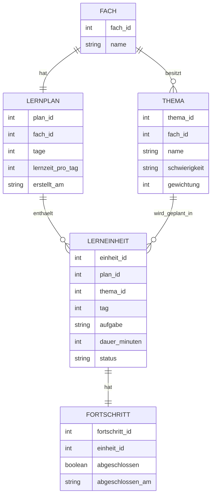
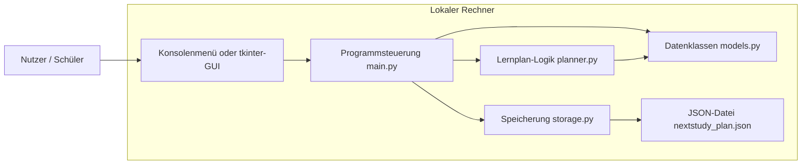
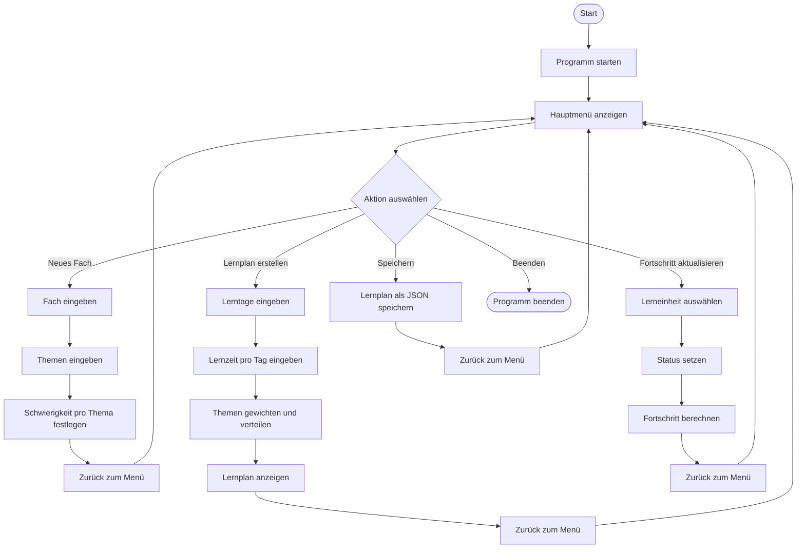

# NextStudy – Projektbeschreibung LF5

## 1. Kurzbeschreibung

**NextStudy** ist ein intelligenter Lernplaner für Schüler, Auszubildende und Lernende.  
Das Programm erstellt aus wenigen Eingaben automatisch einen strukturierten Lernplan.

Der Nutzer gibt ein:

- Fach
- Themen
- Anzahl der verfügbaren Lerntage
- Schwierigkeit der Themen
- tägliche Lernzeit
- optional einen Prüfungstermin

Das Programm berechnet daraus einen Lernplan und verteilt die Themen sinnvoll auf die verfügbaren Tage. Zusätzlich kann NextStudy kleine Wiederholungen, Prioritäten und einen Lernfortschritt verwalten.

Das Ziel ist ein nützliches Python-Tool, das beim Planen von Klausuren, Tests oder Lernphasen hilft.

---

## 2. Projektziel

Ziel des Projekts ist die Entwicklung eines funktionsfähigen Python-Programms, das Lerninhalte organisiert und daraus automatisch einen personalisierten Lernplan erzeugt.

Das Projekt soll zeigen, dass grundlegende Programmierkonzepte verstanden und sinnvoll kombiniert werden können.

Dazu gehören:

- Variablen
- Input/Output
- bedingte Verzweigungen
- Schleifen
- Funktionen
- Klassen
- Listen und Dictionaries
- Bibliotheken
- optional ein grafisches Interface mit `tkinter`
- optional Datei-Speicherung mit JSON

---

## 3. Warum ist NextStudy nützlich?

Viele Schüler und Auszubildende lernen unstrukturiert oder zu spät.  
NextStudy hilft dabei, Lernstoff besser aufzuteilen und jeden Tag klare Aufgaben zu haben.

Beispiel:

Statt einfach nur zu sagen:

> Ich muss Chemie lernen.

macht NextStudy daraus:

```text
Tag 1: Alkane Grundlagen lernen
Tag 2: Siedepunkte und Van-der-Waals-Kräfte wiederholen
Tag 3: Redoxgleichungen üben
Tag 4: Schwächen wiederholen
Tag 5: Testmodus + Zusammenfassung
```

Dadurch weiß der Nutzer jeden Tag genau, was zu tun ist.

---

## 4. Zielgruppe

NextStudy richtet sich an:

- Schüler
- Auszubildende
- Berufsschüler
- Personen, die für Klausuren oder Tests lernen
- Programmieranfänger, die ein nachvollziehbares Python-Projekt verstehen wollen

---

## 5. Hauptfunktionen

### 5.1 Lernfach anlegen

Der Nutzer kann ein Fach eingeben, zum Beispiel:

- Mathematik
- Chemie
- Physik
- LF5
- Englisch
- Politik

Das Fach wird später mit den Themen und dem Lernplan verbunden.

---

### 5.2 Themen eingeben

Der Nutzer kann mehrere Themen eintragen.

Beispiel:

```text
Fach: Chemie
Themen:
- Alkane
- Polarität
- Redoxgleichungen
- Siedepunkte
```

Die Themen werden intern in einer Liste gespeichert.

---

### 5.3 Schwierigkeit festlegen

Für jedes Thema kann eine Schwierigkeit angegeben werden:

- leicht
- mittel
- schwer

Die Schwierigkeit beeinflusst, wie viel Lernzeit das Thema bekommt.

Beispiel:

| Schwierigkeit | Gewichtung |
|---|---:|
| leicht | 1 |
| mittel | 2 |
| schwer | 3 |

Ein schweres Thema wird also stärker berücksichtigt als ein leichtes Thema.

---

### 5.4 Lerntage und Lernzeit eingeben

Der Nutzer gibt an:

- Wie viele Tage bis zur Prüfung bleiben
- Wie viele Minuten pro Tag gelernt werden sollen

Beispiel:

```text
Tage bis zur Prüfung: 5
Lernzeit pro Tag: 60 Minuten
```

NextStudy verteilt die Themen dann auf diese Tage.

---

### 5.5 Lernplan automatisch erstellen

Das Programm erstellt aus allen Eingaben einen Plan.

Beispielausgabe:

```text
Lernplan für Chemie

Tag 1:
- Alkane Grundlagen
- 15 Minuten Wiederholung

Tag 2:
- Polarität
- kurze Übungsfragen

Tag 3:
- Redoxgleichungen
- Beispielaufgaben lösen

Tag 4:
- Siedepunkte vergleichen
- schwierige Themen wiederholen

Tag 5:
- Gesamte Wiederholung
- Testmodus
```

---

### 5.6 Lernfortschritt verwalten

Der Nutzer kann Aufgaben als erledigt markieren.

Beispiel:

```text
Tag 1 abgeschlossen? ja/nein
```

Das Programm speichert dann den Fortschritt.

Mögliche Statuswerte:

- offen
- in Bearbeitung
- abgeschlossen

---

### 5.7 Zusammenfassung anzeigen

Am Ende kann das Programm anzeigen:

- Anzahl der Themen
- Anzahl der Lerntage
- erledigte Aufgaben
- offene Aufgaben
- Fortschritt in Prozent

Beispiel:

```text
Fortschritt: 60 %
Erledigte Aufgaben: 3 von 5
Offene Aufgaben: 2
```

---

### 5.8 Optional: Speicherung

Der Lernplan kann optional als JSON-Datei gespeichert werden.

Beispiel:

```text
nextstudy_plan.json
```

Dadurch kann der Plan später wieder geladen werden.

---

## 6. Geplanter Programmablauf

1. Programm startet
2. Nutzer wählt eine Aktion im Menü
3. Nutzer gibt Fach ein
4. Nutzer gibt Themen ein
5. Nutzer legt Schwierigkeit fest
6. Nutzer gibt verfügbare Lerntage ein
7. Programm berechnet Lernplan
8. Programm zeigt Lernplan an
9. Nutzer kann Fortschritt aktualisieren
10. Programm speichert optional die Daten
11. Programm wird beendet

---

## 7. Menüstruktur

Das Programm kann als Konsolenprogramm starten.

```text
========================
       NEXTSTUDY
========================

1. Neues Fach anlegen
2. Themen hinzufügen
3. Lernplan erstellen
4. Lernplan anzeigen
5. Fortschritt aktualisieren
6. Statistik anzeigen
7. Lernplan speichern
8. Programm beenden
```

Optional kann später eine GUI mit `tkinter` ergänzt werden.

---

## 8. Technische Umsetzung

### 8.1 Programmiersprache

Das Projekt wird in **Python** umgesetzt.

---

### 8.2 Mögliche Dateien

```text
nextstudy/
│
├── main.py
├── models.py
├── planner.py
├── storage.py
├── nextstudy_plan.json
└── README.md
```

Für ein kleineres Schulprojekt kann auch alles in einer Datei umgesetzt werden:

```text
nextstudy.py
```

---

## 9. Python-Grundstrukturen im Projekt

| Grundstruktur | Umsetzung in NextStudy |
|---|---|
| Variablen | Fachname, Lerntage, Lernzeit, Fortschritt |
| Input/Output | Nutzereingaben über `input()` und Ausgabe über `print()` |
| if/else | Menüauswahl, Schwierigkeit, Statusprüfung |
| Schleifen | Hauptmenü läuft mit `while`, Themen werden mit `for` verarbeitet |
| Funktionen | Lernplan erstellen, anzeigen, speichern |
| Klassen | `Fach`, `Thema`, `Lernplan`, `Lerneinheit` |
| Bibliotheken | `json`, optional `datetime`, optional `random` |
| Listen | Themenliste, Tagesplan |
| Dictionaries | Statuswerte, Schwierigkeitsgewichtung |
| GUI optional | `tkinter` für eine einfache Oberfläche |

---

## 10. Klassenmodell

### 10.1 Klasse `Thema`

Speichert ein einzelnes Lernthema.

Attribute:

- `name`
- `schwierigkeit`
- `dauer`
- `status`

Beispiel:

```python
class Thema:
    def __init__(self, name, schwierigkeit):
        self.name = name
        self.schwierigkeit = schwierigkeit
        self.status = "offen"
```

---

### 10.2 Klasse `Fach`

Speichert ein Fach mit mehreren Themen.

Attribute:

- `name`
- `themen`

Beispiel:

```python
class Fach:
    def __init__(self, name):
        self.name = name
        self.themen = []
```

---

### 10.3 Klasse `Lerneinheit`

Speichert eine Aufgabe für einen bestimmten Tag.

Attribute:

- `tag`
- `thema`
- `aufgabe`
- `dauer`
- `status`

---

### 10.4 Klasse `Lernplan`

Speichert den vollständigen Lernplan.

Attribute:

- `fach`
- `tage`
- `lernzeit_pro_tag`
- `einheiten`

---

## 11. ERM / Datenmodell

Das folgende ERM zeigt die wichtigsten Datenobjekte von NextStudy.



---

## 12. Netzwerkplan / Architekturplan

Da NextStudy als lokales Python-Programm geplant ist, braucht es keinen echten Server.  
Der Netzwerkplan zeigt deshalb die logische Architektur auf einem lokalen Rechner.



### Erklärung

- Der Nutzer bedient das Programm über ein Menü oder eine einfache GUI.
- `main.py` steuert den Ablauf.
- `planner.py` berechnet den Lernplan.
- `models.py` enthält die Klassen.
- `storage.py` speichert und lädt Daten.
- Die Daten werden lokal in einer JSON-Datei gespeichert.

---

## 13. BPMN-ähnliches Ablaufdiagramm

Das folgende Diagramm zeigt den Ablauf aus Sicht des Nutzers.



---

## 14. Detaillierter Ablauf der Lernplan-Erstellung

### Schritt 1: Fach wird eingegeben

Beispiel:

```text
Bitte Fach eingeben: Chemie
```

Das Programm erstellt ein Objekt der Klasse `Fach`.

---

### Schritt 2: Themen werden eingegeben

Beispiel:

```text
Thema 1: Alkane
Thema 2: Polarität
Thema 3: Redox
```

Die Themen werden in einer Liste gespeichert.

---

### Schritt 3: Schwierigkeit wird festgelegt

Beispiel:

```text
Alkane: mittel
Polarität: leicht
Redox: schwer
```

Das Programm wandelt die Schwierigkeit in eine Gewichtung um:

```python
gewichtung = {
    "leicht": 1,
    "mittel": 2,
    "schwer": 3
}
```

---

### Schritt 4: Lerntage werden eingegeben

Beispiel:

```text
Wie viele Tage bleiben bis zur Prüfung? 5
```

---

### Schritt 5: Lernzeit wird eingegeben

Beispiel:

```text
Wie viele Minuten möchtest du pro Tag lernen? 60
```

---

### Schritt 6: Programm erstellt Lernplan

Das Programm verteilt die Themen auf die verfügbaren Tage.

Eine einfache Logik wäre:

- schwere Themen bekommen mehr Zeit
- leichte Themen bekommen weniger Zeit
- am letzten Tag wird wiederholt
- wenn mehr Tage als Themen vorhanden sind, werden Wiederholungstage eingefügt

---

### Schritt 7: Lernplan wird angezeigt

Beispiel:

```text
Tag 1: Redox Grundlagen lernen - 60 Minuten
Tag 2: Redox Aufgaben üben - 60 Minuten
Tag 3: Alkane lernen - 60 Minuten
Tag 4: Polarität wiederholen - 60 Minuten
Tag 5: Gesamte Wiederholung - 60 Minuten
```

---

## 15. Beispielhafte Programmlogik

```python
def schwierigkeit_zu_gewichtung(schwierigkeit):
    if schwierigkeit == "leicht":
        return 1
    elif schwierigkeit == "mittel":
        return 2
    elif schwierigkeit == "schwer":
        return 3
    else:
        return 1
```

```python
def lernplan_erstellen(themen, tage):
    plan = []

    for tag in range(1, tage + 1):
        thema = themen[(tag - 1) % len(themen)]
        plan.append({
            "tag": tag,
            "thema": thema.name,
            "aufgabe": f"{thema.name} lernen und wiederholen",
            "status": "offen"
        })

    return plan
```

---

## 16. Geplanter Funktionsumfang für Version 1.0

### Muss-Funktionen

- Fach anlegen
- Themen eintragen
- Schwierigkeit festlegen
- Lernplan erstellen
- Lernplan anzeigen
- Fortschritt markieren
- Statistik anzeigen

### Soll-Funktionen

- Lernplan speichern
- Lernplan laden
- Wiederholungstage automatisch einfügen
- Prüfungstag berücksichtigen

### Kann-Funktionen

- tkinter-GUI
- zufällige Übungsfragen
- Export als Textdatei
- mehrere Fächer verwalten
- farbige Konsolenausgabe

---

## 17. Beispiel für Testdaten

```text
Fach: LF5
Themen:
- Variablen
- Schleifen
- Funktionen
- Klassen
- Listen
- Dictionaries

Tage: 6
Lernzeit pro Tag: 45 Minuten
```

Erwartete Ausgabe:

```text
Tag 1: Variablen lernen und Beispielaufgaben lösen
Tag 2: Schleifen lernen und Beispielaufgaben lösen
Tag 3: Funktionen lernen und Beispielaufgaben lösen
Tag 4: Klassen lernen und Beispielaufgaben lösen
Tag 5: Listen und Dictionaries wiederholen
Tag 6: Gesamtwiederholung und Mini-Test
```

---

## 18. Mögliche Herausforderungen

### Herausforderung 1: Themen sinnvoll verteilen

Problem:  
Wenn viele Themen und wenige Tage vorhanden sind, muss das Programm mehrere Themen auf einen Tag legen.

Lösung:  
Themen werden nach Schwierigkeit gewichtet und dann auf die Tage verteilt.

---

### Herausforderung 2: Fortschritt speichern

Problem:  
Nach dem Beenden des Programms wären die Daten normalerweise weg.

Lösung:  
Die Daten werden in einer JSON-Datei gespeichert.

---

### Herausforderung 3: Eingabefehler

Problem:  
Der Nutzer könnte ungültige Werte eingeben.

Beispiele:

- negative Anzahl an Tagen
- leere Themen
- falsche Schwierigkeit

Lösung:  
Das Programm prüft Eingaben mit `if/else` und fragt bei Fehlern erneut.

---

## 19. Abgrenzung

NextStudy ist keine echte künstliche Intelligenz.  
Das Programm arbeitet mit festen Regeln, Gewichtungen und einfacher Logik.

Es wirkt intelligent, weil es:

- Themen priorisiert
- schwierige Themen stärker gewichtet
- Wiederholungen einplant
- Fortschritt berechnet
- strukturierte Vorschläge erzeugt

---

## 20. Präsentationsidee

Für die Vorstellung kann folgender Ablauf genutzt werden:

1. Problem erklären: Viele lernen unstrukturiert.
2. Lösung vorstellen: NextStudy erstellt automatisch einen Lernplan.
3. Eingaben zeigen: Fach, Themen, Tage, Schwierigkeit.
4. Diagramm zeigen: BPMN-Ablauf.
5. Datenmodell zeigen: ERM.
6. Beispielausgabe zeigen.
7. Kurz erklären, welche Python-Grundstrukturen verwendet werden.

---

## 21. Kurzer Vorstellungstext

> Unser Projekt heißt NextStudy.  
> NextStudy ist ein intelligenter Lernplaner, der Schülern und Auszubildenden hilft, ihren Lernstoff besser zu organisieren.  
> Der Nutzer gibt ein Fach, mehrere Themen, die Schwierigkeit und die verfügbaren Lerntage ein.  
> Das Programm erstellt daraus automatisch einen Lernplan und verteilt die Themen sinnvoll auf die Tage.  
> Zusätzlich kann der Nutzer seinen Fortschritt markieren und eine kleine Statistik anzeigen lassen.  
> Das Projekt ist nützlich, weil viele Lernende Probleme damit haben, ihren Lernstoff rechtzeitig und sinnvoll aufzuteilen.  
> Technisch nutzen wir Python mit Klassen, Listen, Dictionaries, Funktionen, Schleifen, Bedingungen und optional einer JSON-Speicherung.

---

## 22. Bewertungsvorteile

NextStudy erfüllt die Projektanforderungen gut, weil:

- das Tool einen echten Nutzen hat
- der Ablauf klar erklärbar ist
- viele Python-Grundstrukturen verwendet werden
- das Projekt nicht zu groß, aber trotzdem hochwertig ist
- es gut dokumentiert werden kann
- Diagramme und Planung leicht verständlich sind
- eine Erweiterung mit GUI oder Speicherung möglich ist

---

## 23. Geplanter Umfang

Der geplante Quellcode soll ungefähr **150 bis 250 Zeilen** umfassen.

Damit bleibt das Projekt realistisch und passt zum geforderten Umfang.

---

## 24. Mögliche Erweiterungen

Falls noch Zeit bleibt, kann NextStudy erweitert werden durch:

- grafische Oberfläche mit `tkinter`
- mehrere Lernpläne
- Export als `.txt`
- Mini-Quiz pro Thema
- zufällige Wiederholungsfragen
- farbige Statusanzeige
- Kalenderansicht
- Prioritätssystem
- Tagesziele
- Lernstreak

---

## 25. Fazit

NextStudy ist ein praxisnahes Python-Projekt mit einem klaren Nutzen.  
Es hilft beim Planen von Lernphasen und zeigt gleichzeitig viele wichtige Programmiergrundlagen.

Das Projekt ist anspruchsvoller als einfache Standardideen wie Taschenrechner oder Notenrechner, bleibt aber trotzdem realistisch umsetzbar.

Durch das ERM, den Architekturplan und das BPMN-ähnliche Ablaufdiagramm kann die Projektidee gut vorgestellt und nachvollziehbar dokumentiert werden.
