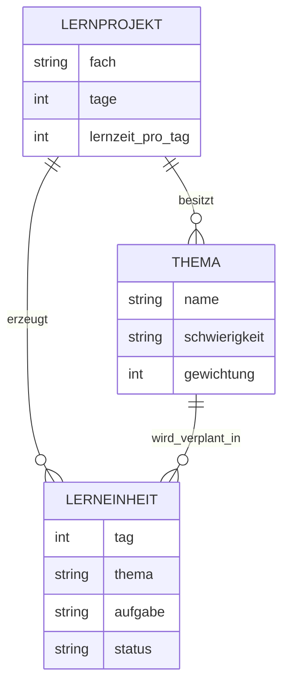
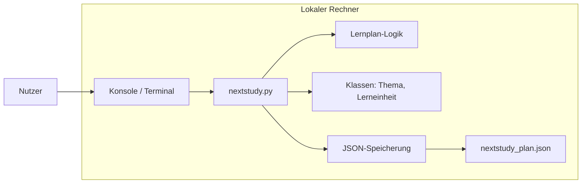
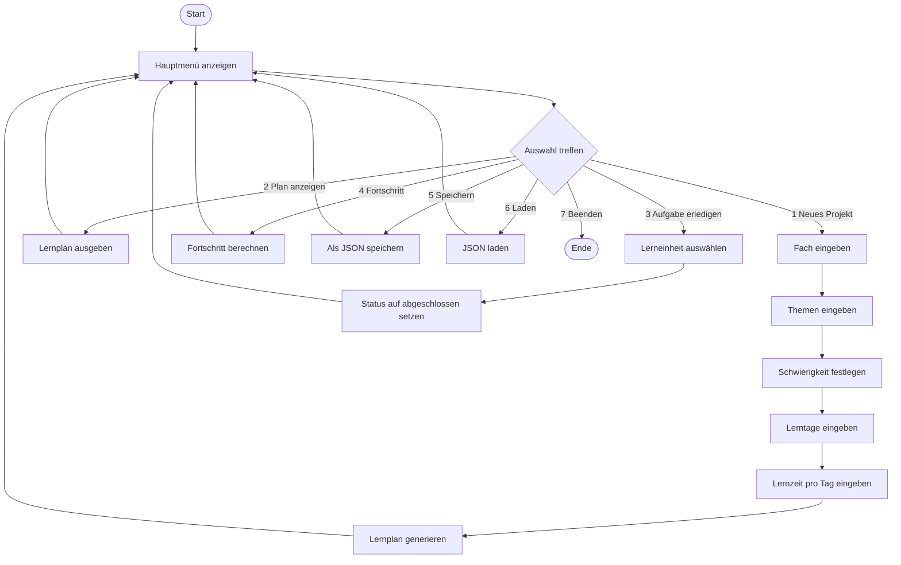

# NextStudy Lite – Projektbeschreibung LF5

## 1. Projektname

**NextStudy Lite**

## 2. Kurzbeschreibung

NextStudy Lite ist ein lokales Python-Konsolenprogramm, das aus wenigen Eingaben automatisch einen Lernplan erstellt.

Der Nutzer gibt ein:

- Fach
- Lernthemen
- Schwierigkeit pro Thema
- Anzahl der verfügbaren Lerntage
- tägliche Lernzeit

Das Programm erstellt daraus einen einfachen Lernplan, zeigt diesen an, erlaubt das Abhaken erledigter Aufgaben und berechnet den Lernfortschritt.

Das Projekt ist bewusst klein gehalten, damit es realistisch in **maximal 300 Zeilen Python-Code** umgesetzt werden kann.

---

## 3. Ziel des Projekts

Ziel ist ein funktionsfähiges Python-Tool, das Lernende beim Planen ihrer Lernzeit unterstützt.

Das Programm soll:

- Lernstoff strukturieren
- Themen nach Schwierigkeit gewichten
- Themen auf Lerntage verteilen
- Aufgaben anzeigen
- Fortschritt berechnen
- optional den Plan als JSON-Datei speichern und laden

---

## 4. Warum ist das Projekt nützlich?

Viele Schüler und Auszubildende lernen unstrukturiert oder fangen zu spät an.  
NextStudy Lite hilft dabei, aus mehreren Themen einen klaren Tagesplan zu machen.

Beispiel:

```text
Fach: Chemie
Themen: Alkane, Polarität, Redox
Tage: 4
Lernzeit pro Tag: 45 Minuten
```

Ausgabe:

```text
Tag 1: Redox lernen und Aufgaben üben
Tag 2: Alkane lernen und wiederholen
Tag 3: Polarität lernen
Tag 4: Gesamtwiederholung
```

---

## 5. Projektumfang

Das Projekt wird als **einzelne Python-Datei** umgesetzt.

```text
nextstudy.py
```

Dadurch bleibt das Projekt übersichtlich und kann leichter erklärt werden.

---

## 6. Nicht Teil des Projekts

Damit das Projekt unter 300 Zeilen bleibt, werden folgende Funktionen bewusst nicht eingebaut:

- keine grafische Oberfläche
- kein Login-System
- keine Datenbank
- kein Webserver
- keine echte KI
- keine Kalenderintegration
- keine Verwaltung mehrerer Nutzer
- keine komplexe App-Struktur mit vielen Dateien

---

## 7. Geplante Funktionen

| Nr. | Funktion | Beschreibung |
|---:|---|---|
| 1 | Lernprojekt erstellen | Nutzer gibt Fach, Themen, Tage und Lernzeit ein |
| 2 | Schwierigkeit festlegen | Jedes Thema bekommt leicht, mittel oder schwer |
| 3 | Lernplan generieren | Programm verteilt Themen automatisch auf Tage |
| 4 | Lernplan anzeigen | Plan wird übersichtlich in der Konsole ausgegeben |
| 5 | Aufgabe erledigen | Nutzer kann eine Lerneinheit als abgeschlossen markieren |
| 6 | Fortschritt anzeigen | Programm berechnet erledigte Aufgaben in Prozent |
| 7 | Speichern | Lernplan wird optional als JSON gespeichert |
| 8 | Laden | Gespeicherter Lernplan kann wieder geladen werden |

---

## 8. Hauptmenü

```text
========================
     NEXTSTUDY LITE
========================

1. Neues Lernprojekt erstellen
2. Lernplan anzeigen
3. Aufgabe als erledigt markieren
4. Fortschritt anzeigen
5. Lernplan speichern
6. Lernplan laden
7. Beenden
```

---

## 9. Programmablauf

1. Das Programm startet.
2. Das Hauptmenü wird angezeigt.
3. Der Nutzer wählt eine Aktion.
4. Beim Erstellen eines Lernprojekts werden Fach, Themen, Schwierigkeit, Lerntage und Lernzeit abgefragt.
5. Das Programm erstellt automatisch einen Lernplan.
6. Der Nutzer kann den Plan anzeigen.
7. Der Nutzer kann Aufgaben als erledigt markieren.
8. Der Fortschritt wird berechnet.
9. Der Plan kann gespeichert oder geladen werden.
10. Das Programm wird beendet.

---

## 10. Python-Grundstrukturen

Das Projekt erfüllt die geforderten Grundstrukturen.

| Grundstruktur | Umsetzung in NextStudy Lite |
|---|---|
| Variablen | Fach, Tage, Lernzeit, Status |
| Input/Output | `input()` und `print()` |
| Bedingungen | `if`, `elif`, `else` im Menü und bei Eingabeprüfungen |
| Schleifen | `while` für Hauptmenü, `for` für Themen und Plan |
| Funktionen | Plan erstellen, anzeigen, speichern, laden |
| Klassen | `Thema` und `Lerneinheit` |
| Bibliotheken | `json` zum Speichern und Laden |
| Listen | Themenliste und Lernplanliste |
| Dictionaries | Umwandlung in speicherbare JSON-Daten |

---

## 11. Datenmodell / ERM

Das Datenmodell ist bewusst reduziert.  
Es gibt nur drei zentrale Objekte:

- Lernprojekt
- Thema
- Lerneinheit



---

## 12. Architekturplan / Netzwerkplan

Da NextStudy Lite lokal auf einem Rechner läuft, gibt es keinen echten Netzwerkserver.  
Der folgende Plan zeigt die logische Programmarchitektur.



### Erklärung

- Der Nutzer bedient das Programm über das Terminal.
- Die Datei `nextstudy.py` enthält die komplette Programmlogik.
- Die Klassen speichern Themen und Lerneinheiten.
- Die Lernplan-Logik verteilt Themen auf Tage.
- Die JSON-Datei speichert den Lernplan dauerhaft.

---

## 13. BPMN-ähnliches Ablaufdiagramm



---

## 14. Geplante Klassen

### 14.1 Klasse `Thema`

Die Klasse `Thema` speichert ein einzelnes Lernthema.

Attribute:

- `name`
- `schwierigkeit`
- `gewichtung`

Beispiel:

```python
class Thema:
    def __init__(self, name, schwierigkeit):
        self.name = name
        self.schwierigkeit = schwierigkeit
        self.gewichtung = self.berechne_gewichtung()

    def berechne_gewichtung(self):
        if self.schwierigkeit == "leicht":
            return 1
        elif self.schwierigkeit == "mittel":
            return 2
        elif self.schwierigkeit == "schwer":
            return 3
        return 1
```

---

### 14.2 Klasse `Lerneinheit`

Die Klasse `Lerneinheit` speichert eine Aufgabe für einen bestimmten Lerntag.

Attribute:

- `tag`
- `thema`
- `aufgabe`
- `status`

Beispiel:

```python
class Lerneinheit:
    def __init__(self, tag, thema, aufgabe):
        self.tag = tag
        self.thema = thema
        self.aufgabe = aufgabe
        self.status = "offen"
```

---

## 15. Lernplan-Logik

Die Lernplan-Logik soll einfach und erklärbar bleiben.

Grundidee:

1. Themen werden nach Schwierigkeit sortiert.
2. Schwere Themen kommen zuerst.
3. Themen werden auf die verfügbaren Tage verteilt.
4. Wenn mehr Tage als Themen vorhanden sind, werden Wiederholungen eingefügt.
5. Der letzte Tag kann als Wiederholungstag genutzt werden.

Beispiel:

| Thema | Schwierigkeit | Gewichtung |
|---|---|---:|
| Redox | schwer | 3 |
| Alkane | mittel | 2 |
| Polarität | leicht | 1 |

Daraus wird:

```text
Tag 1: Redox lernen und Aufgaben üben
Tag 2: Alkane lernen und wiederholen
Tag 3: Polarität lernen
Tag 4: Gesamtwiederholung
```

---

## 16. Speicherformat JSON

Der Lernplan kann in einer JSON-Datei gespeichert werden.

Dateiname:

```text
nextstudy_plan.json
```

Beispielstruktur:

```json
{
  "fach": "Chemie",
  "tage": 4,
  "lernzeit": 45,
  "plan": [
    {
      "tag": 1,
      "thema": "Redox",
      "aufgabe": "Redox lernen und Aufgaben üben",
      "status": "offen"
    },
    {
      "tag": 2,
      "thema": "Alkane",
      "aufgabe": "Alkane lernen und wiederholen",
      "status": "abgeschlossen"
    }
  ]
}
```

---

## 17. Eingabeprüfung

Das Programm soll einfache Fehler abfangen.

Beispiele:

| Fehler | Reaktion |
|---|---|
| Nutzer gibt keine Themen ein | Programm fragt erneut |
| Tage kleiner als 1 | Programm gibt Fehlermeldung aus |
| falsche Schwierigkeit | Standardwert `mittel` oder erneute Eingabe |
| ungültige Menüauswahl | Hinweis und zurück zum Menü |

---

## 18. Beispielausgabe

```text
Lernplan für Chemie

Tag 1:
Thema: Redox
Aufgabe: Redox lernen und Aufgaben üben
Status: offen

Tag 2:
Thema: Alkane
Aufgabe: Alkane lernen und wiederholen
Status: abgeschlossen

Tag 3:
Thema: Polarität
Aufgabe: Polarität lernen
Status: offen

Tag 4:
Thema: Wiederholung
Aufgabe: Alle Themen wiederholen und Selbsttest machen
Status: offen
```

---

## 19. Fortschrittsberechnung

Der Fortschritt wird aus erledigten Aufgaben und allen Aufgaben berechnet.

Formel:

```text
Fortschritt = erledigte Aufgaben / alle Aufgaben * 100
```

Beispiel:

```text
Erledigt: 1 von 4
Fortschritt: 25 %
```

---

## 20. Geschätzte Zeilenanzahl

| Bereich | Geschätzte Zeilen |
|---|---:|
| Import + globale Variablen | 5–10 |
| Klassen | 35–50 |
| Eingabefunktionen | 40–55 |
| Lernplan erstellen | 30–45 |
| Plan anzeigen | 20–30 |
| Fortschritt | 15–25 |
| Speichern/Laden | 30–40 |
| Hauptmenü | 45–60 |
| **Gesamt** | **220–290** |

Damit bleibt das Projekt unter der maximalen Grenze von 300 Zeilen.

---

## 21. Präsentation der Projektidee

### Kurzer Vorstellungstext

> Unser Projekt heißt NextStudy Lite.  
> Es ist ein Python-Programm, das Schülern und Auszubildenden hilft, ihren Lernstoff besser zu organisieren.  
> Der Nutzer gibt ein Fach, mehrere Themen, die Schwierigkeit der Themen, die Anzahl der Lerntage und die tägliche Lernzeit ein.  
> Das Programm erstellt daraus automatisch einen Lernplan.  
> Danach kann der Nutzer Aufgaben als erledigt markieren und seinen Lernfortschritt anzeigen lassen.  
> Das Projekt ist bewusst kompakt gehalten, damit es vollständig in maximal 300 Zeilen Python-Code umgesetzt werden kann.

---

## 22. Warum ist das Projekt geeignet?

NextStudy Lite ist geeignet, weil:

- es einen echten Nutzen hat
- es nicht zu einfach wirkt
- es trotzdem realistisch in 300 Zeilen machbar ist
- es viele Python-Grundlagen enthält
- es gut dokumentiert werden kann
- der Ablauf leicht mit Diagrammen erklärbar ist
- es für Mitschüler nachvollziehbar bleibt

---

## 23. Mögliche Erweiterungen nur falls noch Zeilen frei sind

Diese Erweiterungen sind optional und sollten nur eingebaut werden, wenn die 300-Zeilen-Grenze sicher eingehalten wird:

- farbige Konsolenausgabe
- zufälliger Motivationstext
- Export als `.txt`
- einfacher Wiederholungsmodus
- automatische Sortierung nach Schwierigkeit

Keine dieser Erweiterungen ist für Version 1.0 zwingend notwendig.

---

## 24. Finale Projektdefinition

**NextStudy Lite ist ein kompaktes Python-Konsolenprogramm, das automatisch einen Lernplan aus Fach, Themen, Schwierigkeit, Lerntagen und Lernzeit erstellt. Das Programm verwaltet den Fortschritt des Nutzers und kann den Lernplan optional lokal speichern.**

Die Umsetzung erfolgt in einer Datei:

```text
nextstudy.py
```

Der geplante Umfang liegt bei:

```text
ca. 220–290 Zeilen Python-Code
```

Damit bleibt das Projekt innerhalb der maximal erlaubten Grenze von 300 Zeilen.
